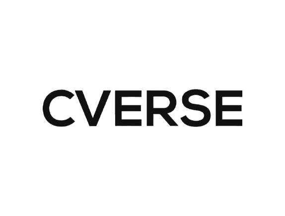

# Demirti Technologies Training Website

A modern, responsive website for Demirti Technologies' digital training programs, featuring specialized tracks in Data Science and Technical Product Management.



## 🚀 Features

- **Specialized Training Tracks**
  - Data Science Track
  - Technical Product Management Track

- **Modern UI/UX**
  - Responsive design for all devices
  - Clean and professional layout
  - Smooth animations and transitions
  - Intuitive navigation

- **Key Sections**
  - Home/Hero section
  - About Us
  - Course Tracks Overview
  - Detailed Track Information
  - Application Process
  - Contact Information

## 💻 Technologies Used

- HTML5
- CSS3
- Font Awesome Icons
- Google Fonts (Montserrat & Inter)
- Responsive Design
- CSS Grid & Flexbox

## 🛠️ Setup and Installation

1. Clone the repository:
   ```bash
   git clone https://github.com/IamDejman/demirti-web.git
   ```

2. Navigate to the project directory:
   ```bash
   cd demirti-web
   ```

3. Open `index.html` in your browser to view the website locally.

## 📱 Responsive Design

The website is fully responsive and optimized for:
- Desktop devices
- Tablets
- Mobile phones

## 📞 Contact Information

- Email: admin@demirti.com
- Phone: 
  - +234 810 107 5670
  - +234 808 993 2753

## 🤝 Contributing

Contributions, issues, and feature requests are welcome! Feel free to check [issues page](https://github.com/IamDejman/demirti-web/issues).

## 📄 License

This project is proprietary and maintained by Demirti Technologies Limited. © 2025 All rights reserved.

## 🌐 Live Website

Visit our website: [Demirti Technologies Training](https://iamdejman.github.io/demirti-web) 